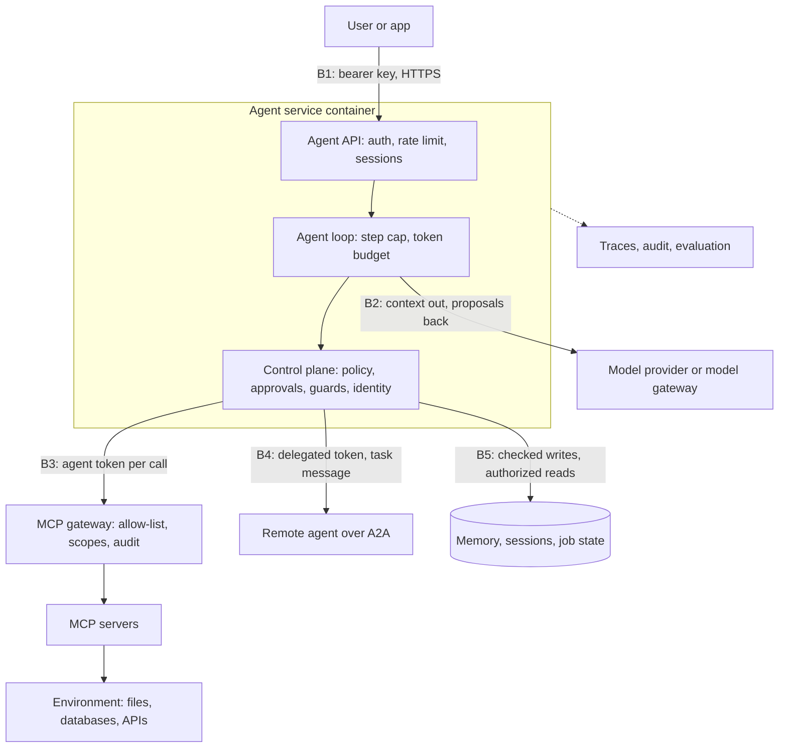

# Architecture

This is the reference architecture the book builds, on a few pages: the layers every agent system has, the trust boundaries between them, what crosses each boundary and what enforces it, where state lives, and which module in this kit plays which part. It's for an engineer who has the repository open but not the book, and wants to know how the pieces fit before changing or extending one. Each point names the book section that teaches it and the file that implements it. Nothing here is production-hardened: the kit's code is labelled Learning demo, Prototype or Production pattern in `course/code_maturity.json`, and the sections below say what a production version adds where it matters.

## The reference model: eleven layers

Section 1.7 introduces the agent architecture reference model and section 30.15 returns to it once every layer is built (reference card 3 in Appendix I). A request arrives through the user interface or API. The runtime plans, recalls memory, assembles context, offers tools and applies policies. The model decides the next step. Tool calls travel over MCP, ordinary APIs or A2A to act on the environment. Evaluation and observability wrap every layer.

| Layer | What it does | Built in | Main code in the kit |
| --- | --- | --- | --- |
| User / API | How requests arrive: chat, an app, another service | Chapter 30 | `ch30_service.py` (agent API), `ch30_client.py` |
| Agent runtime | The loop: steps, limits, retries, sessions | Chapters 4, 19, 24; speed and cost in Chapter 29 | `ch04_agent.py` (`run_agent`, `next_action`), `ch19_durable.py`, `ch19_harness.py`, `ch24_tool_runner.py`, `ch24_agent_sdk.py` |
| Planning | Deciding, checking and revising the steps | Chapters 11, 20 | `ch20_planning.py` (`make_plan`, `check_plan`), `ch11_research_team.py` |
| Memory | What persists across steps and sessions, under which rules | Chapters 5, 17, 18 | `ch05_todo_tools.py`, `ch17_memory_policy.py`, `ch17_memory_security.py` |
| Context | What goes in front of the model on each call | Chapters 6, 16 | `ch16_context.py` (trim, compact, cache), `ch16_assemble.py` |
| Tools | The actions the agent can take | Chapters 2, 3, 7, 8, 9 | `ch03_tools.py`, `ch07_weather_tools.py`, `ch08_sql_tools.py`, `ch09_organizer.py` |
| Policies | Rules code enforces: permissions, approvals, budgets, guards | Chapters 9, 14, 22, 25, 26 | `ch14_policy_agent.py` (`Policy`), `ch22_guarded.py`, `ch25_guards.py`, `ch26_identity.py`, `ch29_costs.py` (budgets) |
| Model | Reads the context, proposes the next step | Chapters 1, 4, 20 | `get_client` in `ch04_agent.py`, `ch20_router.py`, `course/local_adapter.py` |
| MCP, APIs, A2A | How tools and other agents are reached | Chapters 7, 12–15, 21, 30 | `ch13_mcp_agent.py` (`MCPHub`), `ch30_remote_mcp.py`, `ch30_gateway.py`, `ch21_a2a_server.py`, `ch21_a2a_client.py` |
| Environment | Files, databases, browsers, other systems | Chapters 6, 10, 23 | `ch06_notes_tools.py`, `ch10_sandbox.py`, `ch23_browser.py` |
| Evaluation and observability | How you know it works and what it did | Chapters 27, 28 (first versions in 3, 4, 8) | `ch27_eval.py`, `ch27_trajectory.py`, `ch27_scorecard.py`, `ch28_otel.py`, `ch28_ops.py` |

In the model's terms, the **harness** is the runtime plus the policies (section 1.7). The model chooses what to try; the harness decides what's allowed, checks what came back and stops the run.

## The deployed service

Section 30.1 deploys one agent as a container. Callers reach the agent API over HTTPS with a key; the API authenticates, rate-limits and loads the caller's session, then runs the loop with a step cap and a token budget. The loop calls the model provider, a remote MCP server (with a token) and the session database. Secrets arrive at run time; logs and traces go to a collector. On a laptop the session store is SQLite and the collector is the terminal.

The diagram adds the trust boundaries (dashed) that the rest of this document describes, numbered as in the table below.

## Trust boundaries

A boundary is anywhere text, data or authority passes between parties that don't fully trust each other. The book's rule for all of them comes from section 25.3: the prompt is the weakest layer, so anything that must hold is enforced outside the model, in code on the trusted side of the boundary.

| # | Boundary | What crosses it | What enforces it in the kit | What production adds |
| --- | --- | --- | --- | --- |
| B1 | User ↔ agent API | A message in; an answer or stream out; the caller's identity | `ch30_service.py`: refuses to start without `AGENT_API_KEYS`; `api_key` compares with `hmac.compare_digest` and keeps only a SHA-256 key id; `rate_limit` is a per-key token bucket (429 with `Retry-After`); `load_session` serves a session only to the key that created it (404 otherwise); `session_lock` returns 409 on a concurrent request; model failures become a generic 502; logs carry ids and token counts, never message text or keys (section 30.2) | OAuth sign-in from your identity provider (section 30.11), rate-limit buckets in a shared store such as Redis, TLS everywhere |
| B2 | Agent ↔ model provider | Outbound: system prompt, history, tool definitions and tool results, so private data leaves here. Inbound: text and tool-call *proposals* | `get_client` sets a 120-second timeout and 3 retries; `next_action` treats `max_tokens`, `refusal` and context overflow as stops, not answers; `max_iterations` and `should_stop` cap every run (section 4.4); `request_budget` and `DailyBudget` in `ch29_costs.py` (section 29.4); model output is untrusted, so `sanitize_markdown` in `ch25_guards.py` strips image links before rendering (section 25.7) | A model gateway holding provider keys, routing, budgets and fallback (section 30.12); dated model ids pinned per release (section 30.13); keys from a secrets manager, never in the image |
| B3 | Agent ↔ MCP servers and gateway | Tool lists and descriptions in (text the model reads, so a way in for injection); tool calls out; results in | Host side: `MCPHub` passes each server only a minimal environment (`server_env`, section 14.3); `Policy` in `ch14_policy_agent.py` hides tools not on the allow-list (`visible_tools`), re-checks every call and asks a person for `needs_approval` (`before_call`), applies `egress` and `private_sources`, and logs every decision (section 14.5). Company side: `Gateway` in `ch30_gateway.py` is deny-by-default (`POLICY`), checks a Chapter 26 token per call (`_check`), rate-limits per agent and audits every call (section 30.9). Server side: `ch30_remote_mcp.py` validates the token's audience, requires a scope per tool and checks the `Host` header (section 30.4) | Real OAuth tokens, a private registry and pinned versions, hashes of approved tool definitions so a changed description is refused (section 30.10), no token passthrough: the gateway calls servers with its own credentials |
| B4 | Agent ↔ other agents (A2A) | An agent card (discovery), a task message out, status and artifacts back | `RequireToken` in `ch21_a2a_server.py` demands a bearer token for tasks and leaves the card public (section 21.7). `ch26_discovery.py` keeps discovery and trust separate: `discover` never reads descriptor text, `verify` checks publisher, key and pin, `authorize` mints a delegated token that is the intersection of what the capability asks, what your agent holds and what `TrustStore` allows the organization (sections 26.9, 26.10). The remote answer is untrusted content | Public-key signed cards, token exchange across issuers (RFC 8693), trust-store entries backed by a contract |
| B5 | Agent ↔ memory and state | Writes (each one a future prompt) and recalls | `ch17_memory_policy.py`: write gate quarantines instruction-like text, provenance and confidence, `can_read` and `can_write` per scope (sections 17.7, 17.8). `ch17_memory_security.py`: every record stamped with tenant, owner, provenance, trust class, expiry and hash on write; untrusted writes quarantined unless `promote` accepts them; `authorized` filters before ranking and raises `PermissionError` across tenants; hash-chained audit with no memory content (section 17.10) | Encryption with per-tenant keys, row-level security in the database, an append-only audit store the agent can't write, deletion propagated to indexes and caches |
| B6 | Tenant ↔ tenant | Nothing private: compute is shared, data isn't | Sessions per key id (`ch30_service.py`), tenant checks in `SecureMemoryStore`, private caches (section 15.3), one token per agent per user (section 30.12) | Per-tenant keys, rate limits and budgets; tenant id on every trace; tests that try to cross the boundary (ADR-7 in Appendix K) |
| B7 | Agent ↔ environment (side effects) | Actions that change files, records, money or the outside world; data leaving | Approval gate in `run_tool` and audit/undo in `ch09_organizer.py` (sections 9.3, 9.4); the sandbox in `ch10_sandbox.py`; `url_problem` in `ch11_web.py` refuses private addresses on every redirect hop; canary, leak scan and egress checks in `guarded` (`ch25_guards.py`); `authorize` at the tool with ownership, scope and limits, and single-use step-up tokens (`ch26_identity.py`, sections 26.4, 26.6); idempotency keys in `ch19_durable.py` | A policy engine, a human approval service, a kill switch wired to identity (section 26.7) |

Untrusted text has one more boundary inside the agent: in the dual-LLM pattern of section 25.5 (`ch25_quarantine.py`), a reader model with no tools turns untrusted email into short, schema-checked records, and the planner that has tools never sees a raw body.

## The deterministic control plane

Sections 22.1 and 25.11 (reference card 13) name the code that sits between the model and every boundary above. The model is probabilistic, so it proposes; code enforces. The test for which side a decision belongs on: if it were wrong 1 time in 50, would that be acceptable?

| Concern | The control plane (code) | In the kit | The model may |
| --- | --- | --- | --- |
| Identity | Who is acting comes from the login and the agent's token | `mint`, `verify`, `authorize` in `ch26_identity.py`; `config_for` in `solutions/capstones/c1_support/agent.py` | Never name or change the user |
| Policy and permissions | Allow-lists and scopes checked at the tool | `Policy` (`ch14_policy_agent.py`), `Gateway._check` (`ch30_gateway.py`) | Choose among allowed tools |
| Validation | Shape, grounding and records checked before use | `understand` and `check_reply` in `ch22_guarded.py`; `verify` in `ch18_agentic.py` | Propose structured values |
| Budgets | Steps, time and money counted; the run stopped | `max_iterations`, `should_stop` (`ch04_agent.py`); `ch29_costs.py` | Plan within them |
| Approvals | Wait for the right person; run exactly what was approved | `ask_human` and `run_tool` (`ch09_organizer.py`); step-up tokens in `Session` (`ch26_identity.py`) | Propose and explain the action |
| State transitions | Only transitions in the table | `TRANSITIONS` and `Case.move` (`ch22_guarded.py`) | Suggest the next step |
| Audit | Every decision, who made it and why | `audit_log.jsonl` (Chapter 9), `tool_calls.jsonl` (Chapter 14), `AUDIT` in `ch26_identity.py` and `ch30_gateway.py` | Nothing: it never writes its own record |
| Rollback | Undo logs, compensation, kill switch | `undo_plan` (`ch09_organizer.py`), `compensate` (`ch19_durable.py`), `revoke` and `disable` (`ch26_identity.py`) | Report that something looks wrong |

How much of it an agent needs is set by its risk tier: `risk_score`, `tier` and `gaps` in `ch25_risk.py` (section 25.11).

## Gateways and registries

Two front doors appear once a company runs more than one agent (sections 30.9, 30.10, 30.12):

- **MCP gateway** (`ch30_gateway.py`). Agents connect only to the gateway. Only tools in `POLICY` exist; every call needs a token naming the agent, the user, the gateway as audience and the scopes; each agent has its own rate limit; one audit trail records every call, allowed or refused. It caches each server's tool list for that server's `ttlMs` (`Gateway._refresh`). With `progressive=True` it lists only `search_tools` and `use_tool`, so a thousand tools don't fill the prompt. The book warns it's a high-value target: keep it small, log where agents can't write and never forward an agent's token upstream.
- **Model gateway.** One front door to providers that holds the keys, routes by task, enforces budgets and falls back when a provider fails. The kit has the parts, not the service: routing and fallback in `ch20_router.py` (sections 20.7, 20.8), budgets in `ch29_costs.py`.
- **Registries.** The MCP Registry proves who published a server, not that it's safe. Pin versions, watch tool definitions for changes, run third-party servers with the fewest rights, and let the gateway's allow-list have the final word (section 30.10). `ch26_discovery.py` implements the same idea for any capability: a signature proves who, a pin proves what was reviewed.

## The agent platform

Section 30.12 groups shared services so product teams write prompts, tools and evals, not infrastructure. Where the kit has a small version of each:

| Platform component | Kit module | Platform component | Kit module |
| --- | --- | --- | --- |
| Model gateway | `ch20_router.py`, `ch29_costs.py` | Evaluation service | `ch27_eval.py`, `ch27_trajectory.py`, `ch27_scorecard.py` |
| Agent runtime | `ch04_agent.py`, `ch19_durable.py`, Chapter 24 runtimes | Observability | `ch28_otel.py`, `ch28_ops.py` |
| MCP gateway | `ch30_gateway.py` | Memory service | `ch17_memory_security.py` |
| Identity | `ch26_identity.py`, `ch26_discovery.py` | Vector and search | `ch18_rag.py`, `ch18_agentic.py` |
| Secrets | `.env` at run time (Chapter 0, section 30.6) | Workflow engine | `ch19_durable.py`, `ch22_guarded.py` |
| Policy engine | `ch14_policy_agent.py`, `policy.json`, `POLICY` in `ch22_guarded.py` | Human approval | `ch09_organizer.py`, step-up in `ch26_identity.py` |
| Cost controls | `ch29_costs.py`, `ch29_economics.py` | Tenant isolation | `ch17_memory_security.py`, sessions in `ch30_service.py` |
| Audit trail | Chapters 9, 14, 26, 28 | Release pipeline | `ch30_improvement_loop.py`, `ch25_risk.py` (`gaps`) |

Standardize in this order (section 30.12): identity and secrets, gateways, tracing and cost attribution, evaluation gates, then shared memory and retrieval.

## Where state lives

| State | Kit store | Owner and lifetime | Production version |
| --- | --- | --- | --- |
| Conversation history | `messages` in memory; per-session rows in `sessions.db` (`ch30_service.py`), bounded by `AGENT_MAX_HISTORY` | One caller (key id), one session | A managed database; history trimmed and compacted (Chapter 16) |
| Working context | Assembled per call (`ch16_assemble.py`) | One model call | Same; prompt caching for the stable prefix (section 16.7) |
| Task state | `tasks.json` (`ch05_todo_tools.py`) | One user | A real store with owners |
| Long-term memory | SQLite policy store (`ch17_memory_policy.py`); in-memory `SecureMemoryStore` | User, agent or team scope; TTL; tenant in the secure store | Database as source of truth, search index for recall, event log for episodes (section 17.9) |
| Knowledge | Notes files (Chapter 6), embeddings and keyword index (`ch18_rag.py`) | Shared, read-only | A managed retrieval index; your own retrieval eval set |
| Durable jobs | `jobs.db` with checkpoints, attempts, leases (`ch19_durable.py`); `progress.md` and a features file (`ch19_harness.py`) | One job, across crashes | A durable-execution platform (section 19.9) |
| Approvals and audit | `audit_log.jsonl`, `tool_calls.jsonl`, in-memory `AUDIT` lists | Append-only, kept by policy | Append-only storage the agent's credentials can't modify |
| Tokens and trust | Short-lived JWTs, `AGENTS` registry, `TrustStore` | Minutes; revocable | Identity provider, keys in a KMS |
| Traces | `spans.jsonl` (`ch28_otel.py`) | Retention policy | OpenTelemetry to a vendor (section 28.1) |
| Release evidence | `release_decisions.json` (`ch30_improvement_loop.py`); benchmark runs in `benchmarks/` | Kept with the bundle version | Same, attached to each release |

Rule of thumb from section 30.12: share compute, never share memory, sessions, private caches or tokens.

## How the kit maps onto the architecture

- **The loop everything reuses.** `run_agent` in `ch04_agent.py` is the runtime for most chapters; `ch30_service.py` and `ch21_a2a_server.py` both wrap it rather than writing a loop of their own.
- **Tools and environment.** Chapters 2–10 (`ch02_*` to `ch10_*`), with `ch10_sandbox.py` as the isolation boundary for code.
- **Protocol layer.** `ch12_weather_server.py`, `ch13_*_server.py` (servers), `ch13_mcp_agent.py` (host), `ch15_modern.py`, `ch30_remote_mcp.py`, `ch30_jobs_server.py` (long-running tools), `ch30_gateway.py`; A2A in `ch21_a2a_*.py`.
- **Context, memory, knowledge.** `ch16_*`, `ch17_*`, `ch18_*`.
- **Orchestration.** `ch19_*` (durability), `ch20_*` (plans, routing), `ch21_orchestrator.py` and `ch21_coordination.py` (teams), `ch22_guarded.py` (control plane), `ch23_*` (browser and back-office), `ch24_*` (runtimes and skills).
- **Trust.** `ch25_*` (guards, quarantine, risk), `ch26_*` (identity, discovery); `solutions/tests/test_security_scenarios.py` holds 15 scenarios, each with a failure-mode test and a mitigation test (section 25.10), and `dev/security_mutations.py` switches each control off to prove a test notices.
- **Production.** `ch27_*` (evaluation), `ch28_*` (observability), `ch29_*` (performance and economics), `ch30_*` (service, gateway, improvement loop).
- **The whole system.** The case study's support agent and Capstone 1 (`solutions/capstones/c1_support/`) assemble these layers: identity from the login, tools behind MCP and a policy, approvals in code, an evaluation suite.

## Limits

The kit runs one process, stores state in SQLite, JSON files or memory, signs tokens with a shared HMAC key, keeps rate-limit buckets and audit lists in process, and uses demo keys. Files labelled Production pattern have the real controls and records with simplified storage; nothing is Production-hardened. Before real users: section 30.7's launch checklist, the risk tier from section 25.11, and the "what production adds" column above.

## Where this comes from

- Section 1.7 (reference model) and section 30.15 (where each layer is built); reference card 3, Appendix I
- Section 30.1 and section 30.2 (the deployed service), section 30.4 (remote MCP), section 30.8 (long-running tools)
- Section 30.9 and section 30.10 (gateways, registries, supply chain), section 30.12 (platform, tenant isolation)
- Section 22.1 to section 22.8 and section 25.11 (deterministic control plane); reference card 13
- Chapter 14 (policy layer), section 17.10 (memory as a boundary), section 21.7 (A2A), Chapter 25 (attack surface, quarantine, guards), Chapter 26 (identity, discovery, cross-organization trust)
- Code: `course/code/ch04/ch04_agent.py`, `course/code/ch14/ch14_policy_agent.py`, `course/code/ch17/ch17_memory_security.py`, `course/code/ch22/ch22_guarded.py`, `course/code/ch25/ch25_risk.py`, `course/code/ch26/ch26_identity.py`, `course/code/ch30/ch30_service.py`, `course/code/ch30/ch30_gateway.py`, `course/code_maturity.json`
