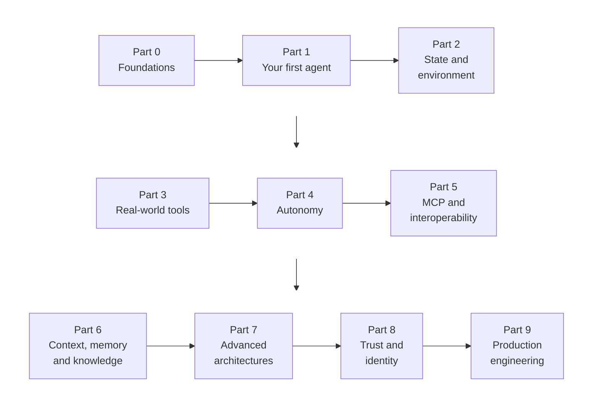

# Chapter 0: Foundations

Every agent in this book is a Python program that sends JSON to a web API and acts on the JSON that comes back. This chapter gives you those pieces, one at a time: the terminal, the Python you'll read and write, JSON, HTTP, API keys and the Docker container everything runs in. You'll finish by writing small programs that parse JSON, call a real weather API and handle its errors.

**What you'll build:** a working course kit, your first model call, and small Python programs that read JSON, call a web API and handle errors.

## Learning objectives

By the end of this chapter you can:

- Open a terminal in the course container and move around with a few commands.
- Read and write the Python used in this book: values, lists, dictionaries, functions, loops and error handling.
- Convert between Python dictionaries and JSON, and read a JSON Schema.
- Call a web API, read its status code and use its JSON answer.
- Keep secrets such as API keys out of your code.
- Explain what Docker, an image, a container and a volume are, in one sentence each.

## Prerequisites

None. This is where the book starts.

## Who this chapter is for

Start here if you've never programmed, or if words like *terminal*, *JSON* or *API* feel shaky. If you already write Python and have called a web API before, skim the chapter summary and do exercises 0.1 and 0.4 to check yourself, then move on to Chapter 1.

:::tip A focused tour, not a full course
Each topic here gets exactly as much as the agents in this book need, and no more. You'll learn to use the terminal, JSON, HTTP and Docker, not to master them. When you want more depth on a topic, the **Learn more** list at the end of this chapter points to free, trustworthy guides, and the Python interlude has a table of the Python fundamentals the book relies on.
:::



Figure: The ten parts of the book {#f:book-map}
Alt: Ten boxes in three rows, joined by arrows in reading order: Part 0 Foundations, Part 1 Your first agent, Part 2 State and environment; Part 3 Real-world tools, Part 4 Autonomy, Part 5 MCP and interoperability; Part 6 Context, memory and knowledge, Part 7 Advanced architectures, Part 8 Trust and identity, Part 9 Production engineering.

{{f:book-map}} shows how the book's ten parts fit together. Short **interludes**, not shown on the map, teach a supporting skill (testing, regular expressions, SQL, measuring an agent, asynchronous Python) right before the chapter that needs it.

## 0.1 The terminal and the course kit

A **terminal** is a window where you type commands instead of clicking. On Windows, open *PowerShell* or *Terminal*; on macOS, open *Terminal*. Go to the folder where you cloned or unzipped the course kit with `cd` ("change directory"):

```bash
cd D:\Learning\building-agentic-ai      # Windows: your own path
cd ~/building-agentic-ai                # macOS / Linux
```

Every command in this book starts with `./course.sh` (macOS and Linux) or `.\course.cmd` (Windows). It runs the command inside the kit's Docker container, so you never install Python or anything else yourself. Try these:

```bash
./course.sh help              # every course command
./course.sh list 0            # the exercises in this chapter
./course.sh shell             # open a terminal INSIDE the container
```

Inside the container shell, these five commands are all you need:

Table: Five shell commands
| Command | What it does | Example |
| --- | --- | --- |
| `ls` | List files in the current folder | `ls notes` |
| `cd` | Change folder | `cd notes/work` (and `cd ..` to go back up) |
| `cat` | Print a file | `cat ch00_json.py` |
| `python` | Run a Python file | `python ch00_json.py` |
| `exit` | Leave the container shell | `exit` |

Your files live in the **workspace** folder next to `course.sh`. The folder is shared: a file you save there with a normal editor on your computer appears instantly inside the container, and the other way round. Any editor works; Visual Studio Code is a good free choice.

## 0.2 Python in one file

This file is a guided tour of every Python feature this book uses. Run it with `./course.sh python ch00_python_tour.py`, then read the code next to the output.

@@code ch00_python_tour.py

The ideas that matter most for agents:

- **Dictionaries** (`{"id": "A1001", "total": 1225.0}`), collections of named values, are how all API data looks in Python. You'll read fields with `order["id"]` or, when a field may be missing, `order.get("coupon", "none")`.
- **Functions** with type hints (`def total_with_tax(amount: float) -> float:`) become an agent's **tool** in Chapter 2 and an MCP tool in Chapter 12.
- **`try` / `except`** catches errors. Instead of crashing, an agent turns an error into text the model can read.

:::tip Reading errors
When Python fails, it prints a *traceback*, the list of calls that led to the error. Read it from the **bottom**: the last line says what went wrong (`KeyError: 'coupon'`), and the line above it says where. Most beginner errors are a typo in a name, a missing quote or wrong indentation.
:::

## 0.3 JSON and JSON Schema

**JSON** is text that looks almost exactly like Python dictionaries and lists. Programs use it to send data to each other over the internet, and a model uses it to send tool requests to your code.

@@code ch00_json.py

`json.dumps` turns a dictionary into JSON text; `json.loads` turns JSON text back into a dictionary. **JSON Schema** is JSON that *describes* other JSON: which fields exist, their types and which are required. You'll write one for every tool in this book, so read the `schema` in the file carefully.

Table: JSON types and their Python equivalents
| JSON | Python |
| --- | --- |
| `{"a": 1}` object | `{"a": 1}` dict |
| `[1, 2]` array | `[1, 2]` list |
| `"text"` string | `"text"` str |
| `3`, `2.5` number | `3` int, `2.5` float |
| `true`, `false` | `True`, `False` |
| `null` | `None` |

## 0.4 Web APIs and HTTP

An **API** (application programming interface) is a way for one program to ask another for something. Web APIs work over **HTTP**, the same protocol your browser uses. A request has a URL, a method (GET to read, POST to send) and optional **parameters** and **headers** (such as an API key). A response has a **status code** and a body, usually JSON.

@@code ch00_http.py

Table: HTTP status codes and what to do about them
| Status | Meaning | What to do |
| --- | --- | --- |
| 200–299 | Success | Read the JSON |
| 400–499 | Your request was wrong (400 bad input, 401 no/invalid key, 404 not found, 429 too many requests) | Fix the request; for 429, wait and retry |
| 500–599 | The server had a problem | Retry later |

The Claude API is a web API too. The `anthropic` library you'll use from Chapter 1 sends these HTTP requests for you, but knowing what happens underneath makes errors much easier to understand.

## 0.5 Secrets and environment variables

An **API key** is a password for an API. Anyone with your key can spend your money, so never write it in code or commit it to Git (the version-control tool that tracks your code's history). Instead, put it in an **environment variable**: a named value the operating system gives to every program it starts.

### Getting an API key

1. Go to the **Claude Console** (platform.claude.com) and create an account. This account is separate from a Claude.ai chat subscription: a Pro or Max plan doesn't include API use, which is billed by the token (a small chunk of text).
2. Under **Billing**, add a small amount of prepaid credit, such as $10. Working through the whole book typically costs $35–75 in total (Appendix E), so you can top up as you go.
3. Under **Limits**, set a **monthly spending limit**. It's your safety net if a loop runs out of control.
4. Under **API keys**, create a key and copy it. It's shown only once; if you lose it, delete it and create a new one.
5. In a terminal in the kit folder, run `./course.sh setup` (Windows: `.\course.cmd setup`) and paste the key when asked. The typing is hidden on purpose.
6. Run `./course.sh check --api`. It makes one tiny call and confirms the key works.

:::note What you should see
A list of checks, each with a ✔, ending with a line like `✔ API call  ready (claude-sonnet-5…)`. The exact model id after `ready` changes as models are updated; what matters is the ✔. A ✘ names what's missing:
- **`API call  AuthenticationError`**: the key is wrong or was pasted with extra characters. Create a new one and run `./course.sh setup` again.
- **`API call  PermissionDeniedError` or a message about credit**: the account has no prepaid credit yet (step 2).
- **`ANTHROPIC_API_KEY  missing`**: `.env` has no key. Run `./course.sh setup`.
- **`GitHub token  not set`** is not an error; only exercises 14.3, 14.4 and Capstone 4 need it.
:::

The kit keeps your key in the `.env` file next to `course.sh`. Docker reads that file and passes the values into the container, where your code reads them with `os.environ.get("ANTHROPIC_API_KEY")`. The `.env` file is already listed in `.gitignore`, so Git ignores it. You don't need to edit it by hand (`setup` does that). If you do, note two traps: its name starts with a dot, so macOS Finder hides it (press Cmd+Shift+. to show hidden files), and Windows Notepad may save it as `.env.txt` unless you choose "All files" when saving.

:::warn Never paste an API key into code, a chat, or a screenshot
If a key leaks, delete it in the provider's console immediately and create a new one. Set a monthly spending limit in the console before you start.
:::

### No budget? Use the free local model

If you'd rather not pay for API calls, you can run an open-source model, `qwen3.5:9b`, in a Docker container on your own computer. It's free, needs no key and runs almost every exercise; it's slower and makes more mistakes than Claude. It needs 16 GB of RAM (32 GB is better), about 10 GB of disk space and, optionally, a GPU.

1. Run `./course.sh setup` and choose option **2**, or put the line `PROVIDER=local` in your `.env` file.
2. Run `./course.sh local up`. It starts the model server and, the first time only, downloads the model (about 6.6 GB). Add `--gpu` if you have an NVIDIA graphics card.
3. Run `./course.sh check --api`. The reply now comes from `qwen3.5:9b`, on your machine.

From then on, every `./course.sh` command uses the local model. `./course.sh local down` stops it and frees the memory. To go back to Claude, change the line to `PROVIDER=claude`. Every exercise in this book is labeled **No model**, **qwen3.5:9b or Claude**, **Claude recommended** or **Claude only**, so you always know which one you need. Appendix H has the details, including Macs, speed tips and what to do when something goes wrong; the same guide is `LOCAL_MODEL.md` in the course kit's repository.

## 0.6 Docker in five minutes

Table: Docker terms and what they mean in the kit
| Word | Meaning | In the course kit |
| --- | --- | --- |
| Image | A frozen, ready-to-run copy of an operating system plus software | `building-agentic-ai:latest`, built once by `./course.sh build` |
| Container | A running copy of an image, isolated from your computer | Started by every `./course.sh` command, removed when it finishes |
| Volume | A folder shared between your computer and a container | Your `workspace` folder, seen as `/workspace` inside |
| Compose | A file describing containers and how they connect | `compose.yaml` in the kit |

So `./course.sh ex 4.2` means: *start a container from the course kit's image, with my workspace folder attached, run exercise 4.2 inside it, then remove the container.* Nothing is installed on your computer except Docker, and your files survive because they live in the workspace volume.

## Common mistakes

- **Running commands from the wrong folder.** `course.sh` must be run from the kit folder (or with its full path).
- **Editing the file in the kit's `course` folder instead of `workspace`.** The `course` folder is the original copy baked into the image; your working files are in `workspace`.
- **Mixing tabs and spaces in Python.** Use four spaces for indentation; any editor can insert them automatically.
- **Putting an API key in code.** Use `.env` and `os.environ`.

## Summary

- The terminal runs commands; `./course.sh` runs them inside the course container.
- Dictionaries, lists, functions and `try`/`except` are the Python this book relies on.
- JSON is how programs exchange data; JSON Schema describes what valid JSON looks like.
- Web APIs return a status code and (usually) JSON; 4xx means fix your request, 5xx means retry.
- Secrets live in environment variables, never in code.

Next comes the Python interlude. It covers the handful of features the tour skipped but later chapters rely on, such as comprehensions, `fn(**args)`, classes and decorators, so that the tool-calling code in Chapter 1 reads as familiar rather than foreign.

## Learn more

Free, trustworthy places to read more about this chapter's topics. Start with the **Start here** rows; **Go deeper** rows are for when you want more detail. Links were checked in September 2026; if one has moved, search for its title.

| Resource | What you'll find | Level |
| --- | --- | --- |
| **MDN: Command line crash course**<br>[developer.mozilla.org/en-US/docs/Learn_web_development/Getting_started/Environment_setup/Command_line](https://developer.mozilla.org/en-US/docs/Learn_web_development/Getting_started/Environment_setup/Command_line) | The terminal from zero: folders, paths, running commands | Start here |
| **Docker: Get started**<br>[docs.docker.com/get-started](https://docs.docker.com/get-started/) | What images and containers are, with a guided first run | Start here |
| **Docker Desktop install guide**<br>[docs.docker.com/desktop](https://docs.docker.com/desktop/) | Step-by-step install for Windows, macOS and Linux | Start here |
| **Claude docs: Get your API key**<br>[platform.claude.com/docs/en/get-api-key](https://platform.claude.com/docs/en/get-api-key) | The official step-by-step guide to creating a key | Start here |
| **Claude Console: API keys**<br>[platform.claude.com/settings/keys](https://platform.claude.com/settings/keys) | Where you create API keys, add billing and set spending limits | Start here |
| **JSON introduction**<br>[json.org/json-en.html](https://www.json.org/json-en.html) | The whole JSON format on one page | Start here |
| **JSON Schema: Getting started**<br>[json-schema.org/learn/getting-started-step-by-step](https://json-schema.org/learn/getting-started-step-by-step) | How schemas describe data, the format every tool uses | Go deeper |
| **MDN: An overview of HTTP**<br>[developer.mozilla.org/en-US/docs/Web/HTTP/Guides/Overview](https://developer.mozilla.org/en-US/docs/Web/HTTP/Guides/Overview) | Requests, responses, status codes and headers | Go deeper |
| **The Twelve-Factor App: Config**<br>[12factor.net/config](https://12factor.net/config) | Why secrets live in environment variables, not in code | Go deeper |

## Exercises

Build exercises (0.4–0.7) start from a file with the function names and examples in place; `./course.sh ex 0.4` creates it. When you think you're done, `./course.sh check 0.4` tells you whether your code is right and, if not, which case fails.

:::ex Concept | 0.1 | What happens when you press Enter?
Describe, step by step, what happens when you type `./course.sh python ch00_json.py`: which program runs first, what Docker starts, where the file comes from and what happens to the container afterward.
**Done when:** Your answer mentions the image, the container, the workspace volume and that the container is removed at the end.
:::

:::ex Concept | 0.2 | Read the schema
Using the `schema` in `ch00_json.py`, say whether each input is valid and why: (a) `{"city": "Pune"}`; (b) `{"city": "Pune", "days": 0}`; (c) `{"city": 42}`; (d) `{"days": 5}`; (e) `{"city": "Oslo", "days": 16, "units": "C"}`.
**Done when:** All five are classified, and you've noticed what the schema says (or doesn't say) about extra fields like `units`.
:::

:::ex Simple | 0.3 | Your shared workspace
On your computer, create a file `workspace/hello.py` containing `print("Hello from my computer")`. Run it with `./course.sh python hello.py`. Then, inside `./course.sh shell`, create `workspace/from_container.txt` with `echo hi > from_container.txt` and find it on your computer.
**Done when:** You've seen a file travel both ways.
:::

:::ex Simple | 0.4 | Write three functions
Create `exercises/ex0_4_basics.py` (the Run command below creates a starter) with three functions: `word_count(text)` returns the number of words; `most_common_word(text)` returns the most frequent word, ignoring case; `invoice_total(items)` takes a list of `{"price": ..., "qty": ...}` dictionaries and returns the total.
**Hint:** `text.lower().split()` gives a list of words; a dictionary can count them.
**Done when:** Running the file prints correct results for three examples of each function, and `./course.sh check 0.4` passes.
:::

:::ex Medium | 0.5 | Summarize a forecast
Write `summarize_forecast(json_text)` that takes the JSON text of a multi-day forecast (use the `forecast` example in `ch00_json.py` as input) and returns a dictionary with the hottest day, the average maximum temperature and the list of days with rain probability above 0.5. Return a clear error string if the JSON is invalid.
**Hint:** Catch `json.JSONDecodeError`.
**Done when:** It gives the right answer for the example and a readable error for `"not json"`, and `./course.sh check 0.5` passes.
:::

:::ex Medium | 0.6 | A careful API call
Write `city_temperature(city)` that calls the Open-Meteo geocoding API (`https://geocoding-api.open-meteo.com/v1/search?name=<city>&count=1`), then the forecast API, and returns today's maximum temperature. Handle three failures, each with an `ERROR:` message: no network, a non-200 status and a city that isn't found.
**Hint:** Open `https://geocoding-api.open-meteo.com/v1/search?name=Pune&count=1` in your browser first to see the JSON. The coordinates are in `results[0]`, and when no city matches, there's no `results` key at all.
**Done when:** It works for three real cities, returns sensible errors for "Xyzzyqq" and for a wrong URL, and `./course.sh check 0.6` passes.
:::

:::ex Complex | 0.7 | Expense report tool
Write a small program that reads `expenses.csv` (columns: `date,category,amount`), totals spending per category and per month, and writes the result to `expense_report.json`. Generate a sample CSV with at least 30 rows yourself. Handle bad rows (missing amount, non-number) by skipping them and counting how many were skipped.
**Hint:** Python's `csv.DictReader` reads each row as a dictionary.
**Done when:** The JSON report is correct for your sample, including a `skipped_rows` count, and the program never crashes on a bad row.
:::

## Checkpoint: end of Chapter 0

Before the Python interlude, check that you can, without looking back:

- [ ] Run a file in the container and find the file you created on your computer.
- [ ] Write a function that takes a list of dictionaries and returns a number.
- [ ] Turn a dictionary into JSON and back, and explain what a schema's `required` means.
- [ ] Say what a 401, a 429 and a 503 status code mean.
- [ ] Explain why an API key goes in `.env` and not in code.
