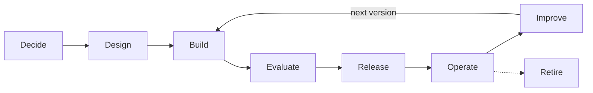

# Chapter 1: What an Agent Is (and Isn't)

Before you build an agent, you need to know what one is and when you don't need one at all. In this chapter you'll make your first call to a large language model (LLM), read what comes back and watch the model fail at three kinds of questions that tools will later fix. You'll also build a small fixed workflow, so that the difference between a workflow and an agent is something you've felt, not only read about.

**What you'll build:** a one-call summarizer, a fixed workflow and a written design note that decides whether a problem needs an agent at all. You'll also meet the book's two frameworks: the dimensions of agency and the agent architecture reference model.

## Learning objectives

By the end of this chapter you can:

- Make an LLM API call and read its response, token usage and stop reason.
- Decide whether a problem needs an agent, or a function, workflow, state machine or RAG instead.
- Describe any system by its dimensions of agency: autonomy, state, planning, tool use, environment, persistence, feedback, delegation and adaptation.
- Name the four parts of every agent: model, tools, loop and stop condition.
- Show three kinds of questions a plain LLM cannot answer reliably.
- Place a system on the agent architecture reference model, and explain context engineering and the harness.
- Choose the kind of agent a problem needs, and name the stages of an agent's lifecycle.

## Prerequisites

Chapter 0 and the Python interlude, or equivalent experience: you can run a Python file from a terminal and read a dictionary.

## Real-world connection

Most "AI features" in products today are not agents. They are a single, well-prompted LLM call: summarize this ticket, classify this email, draft this reply. Anthropic's engineering guide *Building effective agents* puts it plainly: optimizing a single LLM call with retrieval and examples "is usually enough" for many applications. Knowing when you don't need an agent is the first skill of an agent builder.

## 1.1 Anatomy of an LLM call

An LLM API call sends a list of **messages** and gets one new message back. Each message has a **role** (`user` or `assistant`) and **content**. A **system prompt** sets the model's behavior for the whole conversation.

@@code ch01_summarize.py

Run it and look at three things in the response:

- `response.content`: a list of **content blocks**. Current models such as Claude Sonnet 5 **think before they answer**, so the list usually starts with a `thinking` block (its text is hidden unless you ask for it) and then a `text` block with the answer. In Chapter 2 you'll also see `tool_use` blocks. That's why the listing picks blocks by their `type` instead of taking `content[0]`.
- `response.usage`: input and output **tokens**. Thinking counts as output, so set `max_tokens` with room to spare: a limit of a few hundred can run out before the answer starts. Tokens are chunks of text (roughly ¾ of a word in English). You pay per token, and the model can only see a limited number at once (its **context window**).
- `response.stop_reason`: why the model stopped. `end_turn` means it finished. `max_tokens` means it was cut off. `tool_use` (Chapter 2) means it wants to call a tool. There are a few more, such as `refusal`; Chapter 4 handles them all.

:::note What you should see
One sentence, then a line of counts, such as:

```
Priya's express-delivered standing desk (order #4471) hasn't shipped; she wants its location and an express-fee refund if it won't arrive by Saturday.
input tokens=118 output tokens=212 stop_reason=end_turn
```

Your sentence and counts will differ from run to run; `stop_reason=end_turn` is what to check. If you see `stop_reason=max_tokens` and little or no text, the thinking used up the limit: raise `max_tokens`. An `AuthenticationError` means the key isn't set (section 0.5). On the local model, the counts are the local model's own and the sentence is usually plainer.
:::

:::tip The model has no memory between calls
Every call is independent. If you want the model to "remember" earlier messages, you must send them again in the `messages` list. This is the most important fact about building on LLMs, and it's why agents keep a growing message history.
:::

## 1.2 Where plain LLMs fail

An LLM predicts text from what it learned during training. That makes it good at language and reasoning, but it has three hard limits:

1. **It doesn't know the present.** Its knowledge stops at a training cutoff, and it has no clock.
2. **It is unreliable at exact computation.** It can estimate 48,213 × 9,771, but it may get digits wrong.
3. **It cannot see your private data.** Your files, databases and company systems were never in its training data.

@@code ch01_where_llms_fail.py

Run this and compare the answers to reality. The model may guess a date, get the product slightly wrong and either refuse or make up a password. Each failure points to a missing **tool**: a clock, a calculator and a file reader. The rest of this book adds those tools.

## 1.3 Do you actually need an agent?

An agent is not automatically better than ordinary software. It's slower, costs more per request, is harder to test and can fail in ways a function can't. So the first design question is always the same: **why introduce autonomy here?** Line up the options from least to most autonomous:

Table: Options from least to most autonomous
| Option | Who decides the steps? | Example | Use it when |
| --- | --- | --- | --- |
| Function | You, in code; no model | Calculate a refund from a price and a date | The rules are exact and known |
| Workflow | You, in code, with model calls at fixed steps | Extract fields, classify, draft a reply | The steps are known in advance |
| State machine | You: states and allowed transitions, with model calls inside states | A refund case: received, understood, approved, refunded | The process has rules, stages and audits |
| RAG | You: search, then one model call over the results | Answer from the policy handbook | The job is answering from documents |
| Single LLM call | Nobody; there is one step | Summarize a document | One prompt does the job |
| Agent | The model, at run time | "Find why checkout got slow yesterday" | The steps depend on what you find along the way |
| Multi-agent system | Several models, coordinated by code | A lead that sends researchers in parallel | The work splits into independent parts |

A **workflow** chains LLM calls along a path you wrote. It's predictable, cheap and simple to test. An **agent** lets the model choose what to do next based on the results so far. It's flexible, but it costs more, and its mistakes can compound.

Before you choose an agent, answer four questions:

1. **Can I draw the flowchart before the task starts?** If yes, a workflow or state machine will be cheaper and more reliable.
2. **What does a wrong step cost?** The more an action can hurt (money, data, customers), the more of the process belongs in code.
3. **Can I tell when it's done and whether it's right?** An agent you can't evaluate is a demo, not a product (Chapter 27).
4. **Is the flexibility worth several times the cost and latency?** Measure it; don't assume it (exercise 1.7).

:::tip Rule of thumb
If you can draw the flowchart before the task starts, build a workflow. If the flowchart depends on what you discover, build an agent. Either way, keep the rules that must never bend in code. This book returns to the question often: Chapter 11 asks when a team of agents is worth its cost, and Chapter 22 builds a system in which the model only reads and writes text while code controls every decision.
:::

## 1.4 What makes a system agentic?

"Agentic" isn't a yes-or-no label. Systems sit on a spectrum, and each step to the right hands the model more of the decisions:

@@image d-92d2373df655.png

Figure: The spectrum of agentic systems
Alt: Six boxes in order, each handing the model more of the decisions: LLM call, workflow, tool-using agent, autonomous agent, multi-agent system, long-running agent.

What moves a system along the spectrum is a set of **dimensions of agency**. Use them to describe any system precisely, instead of arguing about whether it "is an agent":

Table: The dimensions of agency
| Dimension | The question it answers | Where this book builds it |
| --- | --- | --- |
| Autonomy | How many decisions does the model make without a person? | Chapters 4, 9, 22 |
| State | What does it keep track of between steps and sessions? | Chapters 5, 17, 19 |
| Planning | Does it decide the steps before acting, and revise them? | Chapter 20 |
| Tool use | Which actions can it take in the world? | Chapters 2, 3, 7, 8 |
| Environmental interaction | Can it observe and explore its surroundings: files, pages, screens? | Chapters 6, 10, 23 |
| Persistence | Does its work survive crashes and run for hours? | Chapter 19 |
| Feedback | Does it check results and correct itself? | Chapters 8, 10, 27 |
| Delegation | Can it hand work to other agents? | Chapters 11, 13, 21 |
| Adaptation | Does it change its behavior from experience: memory, skills? | Chapters 17, 24 |

A summarizer scores low on every dimension. The code-fixing agent of Chapter 10 scores high on tool use, environment and feedback but low on persistence. A multi-day research agent scores high on almost all of them. Each dimension you turn up makes the system more capable and gives it one more way to fail, so turn up only the ones the task needs. This framework runs through the whole book: every chapter adds to one or more of these dimensions, and the controls that keep it safe.

## 1.5 The four parts of an agent

Every agent in this book, from the calculator to the MCP capstone, has the same four parts:

Table: The four parts of an agent
| Part | What it is | Where you'll build it |
| --- | --- | --- |
| Model | The LLM that reads the conversation and decides what to do | Every chapter |
| Tools | Functions the model can ask your code to run | Chapter 2 |
| Loop | Code that runs tools and sends results back until the model is done | Chapter 4 |
| Stop condition | When to end: a final answer, an iteration cap, a budget | Chapter 4 |

Here is the whole idea in pseudocode:

```
messages = [user_question]
while True:
    response = llm(messages, tools)
    if response wants a tool:
        result = run_the_tool(...)      # YOUR code runs it, not the model
        messages += [response, result]  # the model sees the result next time
    else:
        return response.text            # the model is done
```

The model never runs anything itself; it only **asks**. Your code decides whether and how to act. That separation is what makes agents safe to build.

@@image d-f180645aa742.png

Figure: The four parts of an agent: model, tools, loop and stop condition
Alt: A user question goes to the model. The model either gives a final answer or asks for a tool; your code runs the tool and sends the result back to the model. A stop condition, such as an iteration cap or a budget, can also end the loop with an answer.

:::tip Where this book is heading: MCP
For most of this book, your tools are Python functions inside your own program. In Part 5 you'll package them as **MCP servers**. The Model Context Protocol (MCP) is the open standard that lets any compatible agent use them: Claude Desktop, VS Code, ChatGPT, Cursor or an agent you write. You'll also plug in servers other people wrote, for files, Git, GitHub and the web. Every tool you build from Chapter 2 onward is a future MCP server, so the habits you learn now (clear descriptions, safe inputs, errors returned as text) carry straight over.
:::

## 1.6 A fixed workflow, for contrast

Before you build agents, build one workflow so you can feel the difference. This three-step support-email workflow always runs the same steps in the same order:

```
def handle_email(email: str) -> str:
    fields = llm(f"Extract order_id and complaint as JSON:\n{email}")
    category = llm(f"Classify as refund, shipping or other:\n{fields}")
    return llm(f"Draft a polite reply for a {category} request:\n{fields}")
```

The model decides nothing here except the text inside each step. If a customer's email needs an order lookup, this workflow can't do it, because nobody wrote that step. An agent could decide to look up the order. That flexibility is what you pay for with agents.

## 1.7 The agent architecture reference model

The four parts make an agent that works on your laptop. A production agent system has more layers, whatever language, model or framework it uses. This book organizes all of them in one **reference model**:

@@image d-bf14742724b1.png

Figure: The agent architecture reference model {#f:reference-model}
Alt: Layers from top to bottom inside a frame labeled evaluation and observability across all layers: user or API; the agent runtime, containing planning, memory, context, tools and policies; the model; MCP, APIs and A2A; and the environment.

Table: The layers of the reference model
| Layer | What it does |
| --- | --- |
| User / API | How requests arrive: a chat, an app, another service |
| Agent runtime | The loop and everything it manages: steps, limits, retries, sessions |
| Planning | Deciding the steps, checking them, revising them |
| Memory | What the agent keeps across steps and sessions, and under which rules |
| Context | What goes in front of the model on each call, and what stays out |
| Tools | The actions the agent can take |
| Policies | The rules code enforces: permissions, approvals, budgets, guards |
| Model | The LLM that reads the context and decides the next step |
| MCP, APIs, A2A | How tools and other agents are reached: standard protocols or plain APIs |
| Environment | The world the agent acts on: files, databases, browsers, other systems |
| Evaluation and observability | How you know it works, and what it did, at every layer |

Every chapter from here on opens with a **You are here** line that names the layers it builds. Section 30.14 returns to {{f:reference-model}} once you've built every layer.

Two ideas hold the layers together.

**Context engineering.** During a call, the model knows only what's in its context window: the system prompt, the conversation so far, the tool definitions and the tool results. It has no other memory and can't look anything up by itself. So the quality of every decision depends on what you put in front of the model, and what you leave out. Choosing that, call by call, is called *context engineering*. You'll meet it in small ways from Chapter 4 (why history grows) and Chapter 6 (keeping large files out of the context), and head-on in Chapter 16.

**The model decides, code enforces.** Everything around the model (the loop, the tools, the checks, the limits) is called the *harness*, and it's yours. The model chooses what to try next; the harness decides what's allowed, checks what came back and stops the run when it should. The more an agent can do, the more of the work moves into the harness. In the reference model, the harness is the runtime and the policies.

## 1.8 The route, and one agent to follow through it

Here's the route through the book, one question per part. Together the parts make one promise: **build, secure, evaluate, optimize, deploy**.

Table: The route through the book, one question per part
| Question | What you add | Part |
| --- | --- | --- |
| Can it act? | Tools, the loop and stop conditions | 1 |
| Can it keep track and look around? | State that outlives a session; search over files | 2 |
| Can it work with real systems, safely? | APIs, self-correction, human approval | 3 |
| Can it check its own work, or split a big job? | Feedback loops and teams of agents | 4 |
| Can any app use its tools, and it use theirs? | MCP servers and clients | 5 |
| Does it know the right things at each step? | Context engineering, memory and knowledge | 6 |
| Can it run for hours, plan and cooperate, with code in control? | Durable jobs, planning, orchestration, deterministic controls | 7 |
| Can it be turned against you? | Security and agent identity | 8 |
| Is it measured, observed, affordable and deployed? | Evaluation, observability, performance, deployment and MCP at company scale | 9 |

Most chapters build a small, focused agent of their own. To see how the pieces add up, follow one system through the whole book: **the enterprise support agent** for an online store. It starts in section 1.6 as a fixed workflow that drafts replies to support emails. Look for the boxes titled *The support agent so far*: each one shows what that chapter adds to it.

Table: How the support agent grows, chapter by chapter
| Chapter | The support agent gains |
| --- | --- |
| 1 | A single call, then a fixed workflow: user → LLM |
| 2 | Tools: user → agent → order lookup |
| 4 | The loop: several lookups in a row, with a step cap and a trace |
| 5 | State: open cases that survive a restart |
| 7 | A real API: carrier tracking with timeouts, retries and a cache |
| 9 | Approval: a person approves every refund |
| 12 | MCP: its order tools, packaged once for any host |
| 14 | A server it didn't write: the helpdesk's tickets, behind a policy layer |
| 16 | Context: the right records and policy passages on every step |
| 17 | Memory: returning customers remembered, under a policy |
| 18 | Knowledge: answers from the policy handbook, with citations |
| 19 | Durability: refunds that wait days for a returned parcel |
| 20 | Routing: easy questions to a small model, hard ones to a large one |
| 21 | Specialists: a lead that delegates to billing and shipping agents |
| 22 | Control: a state machine and rules as data around every refund |
| 25 | Security: customer emails read by a model that can't act |
| 26 | Identity: its own scoped, short-lived tokens |
| 27 | Evaluation: a scorecard and a release gate |
| 28 | Observability: traces, SLOs and alerts |
| 29 | Performance: latency and cost per resolved conversation |
| 30 | Production: a secure service on a shared platform |

Capstone 1 asks you to build its core yourself (MCP servers, approvals, identity, memory and evaluation), with a reference solution to compare against.

## 1.9 Kinds of agents and when to use each

Section 1.3 asked whether you need an agent at all. Once the answer is yes, the next question is which kind. Agents differ less in their code (they all run the same loop) than in what they act on, how long they run and what can go wrong. These are the kinds this book builds:

Table: Kinds of agents and when to use each
| Kind | Choose it when | Avoid it when | Main risk to control | Built in |
| --- | --- | --- | --- | --- |
| **Assistant with tools**: answers a person, looking things up as needed | Questions need live or private data, a few lookups each | A fixed workflow covers every request | Wrong tool or invented answer | Chapters 2–5, 7 |
| **Knowledge agent**: answers from documents, with citations | The answer is written down somewhere, but where varies | The data is structured; query it instead | Confident answers the sources don't support | Chapters 6, 18 |
| **Data analyst**: turns questions into queries | People ask new questions of the same database | A dashboard answers the same question every day | Plausible numbers from a wrong query | Chapter 8 |
| **Action agent behind approvals**: changes records, files or money | The change depends on judging a messy request | The rules alone decide the change | Damage from one wrong action | Chapters 9, 22, 26 |
| **Feedback-loop agent**: works until a check passes, as in fixing code | An objective check exists: tests, a validator, a compiler | Success is a matter of taste | Gaming or editing the check itself | Chapter 10 |
| **Research team**: a lead and parallel subagents | A broad question splits into independent parts | One agent with a few searches would do | Cost multiplied by the number of agents | Chapters 11, 21 |
| **Planner**: writes the steps first, then runs them | Long tasks where "done" must be defined up front | Short questions; planning only adds a call | A bad plan run faithfully | Chapter 20 |
| **Long-running agent**: works for hours across crashes and people | The job outlives one process or one sitting | It finishes in a minute | Repeated side effects after a restart | Chapter 19 |
| **Computer-use agent**: operates a screen | The only way in is a user interface | An API or MCP server exists | One click that can't be taken back | Chapter 23 |

Real systems combine kinds. The support agent you'll follow through the book starts as an assistant with tools, gains a knowledge base in Chapter 18, takes actions behind approvals from Chapter 9 and becomes a small team in Chapter 21. When you design one, name the kind of each part: it tells you which chapter's controls that part needs.

## 1.10 The agent lifecycle

A working demo isn't the end of an agent's life; it's near the beginning. Every agent you'll ship goes through the same stages, and most of this book is about the ones after the demo:



Figure: The agent lifecycle
Alt: Decide, design, build, evaluate, release, operate and improve in a row. Improve loops back to build for the next version, and operate leads, dotted, to retire.

Table: The stages of the agent lifecycle
| Stage | The question | Where the book teaches it |
| --- | --- | --- |
| Decide | Does this problem need an agent, and which kind? | Sections 1.3 and 1.9 |
| Design | Which tools, context, rules and checks will it have? | The design note in exercise 1.7; every chapter's controls |
| Build | Does it work, step by step? | Chapters 2–24 |
| Evaluate | Is it right often enough, and safely? | Chapter 3's first eval, the measurement interlude, Chapter 27 |
| Release | Can it go live without surprises? | Approval gates (Chapter 9), CI gates (section 27.7), the launch checklist (section 30.7) |
| Operate | What is it doing, and what does it cost? | Chapters 28 and 29 |
| Improve | What failed, and did the fix work? | Turning failures into test cases (section 27.8) |
| Retire | How do you switch it off cleanly? | Section 30.13 |

You don't need to plan every stage before your first agent. But each time a chapter adds a check, a gate or a trace, ask which stage it serves; Part 9 puts them together, and section 30.13 walks through the whole lifecycle once you've built every piece.

## Architect's Takeaway

Autonomy has a cost: measure whether an agent saves money before building one.

## Common mistakes

- **Building an agent when a workflow or one prompt would do.** It adds cost and failure modes for no benefit. A five-step workflow that costs $0.05 beats a one-step agent that costs $0.20, even if the agent is smarter.
- **Arguing about whether something "is an agent".** Describe it by its dimensions instead, and turn up only the ones the task needs.
- **Forgetting that calls are stateless.** Sending only the newest message loses the conversation.
- **Reading `response.content[0].text`.** On models that think first, block 0 is a thinking block and this line crashes. Select text blocks by `type`.
- **Ignoring `stop_reason`.** A response cut off at `max_tokens` looks like a real answer but is incomplete.
- **Forgetting that models hallucinate.** A model that sounds confident is still guessing. "It looked right" is not a test; measure success against reality.
- **Autonomy without observation.** Log decisions and tool calls from day one, even if you ignore the logs until something breaks.
- **No stop condition.** An agent without iteration caps or timeouts can spend your budget in seconds. Set them before the first real call.
- **Hard-coding the API key in source files.** Use environment variables and keep `.env` out of Git. A leaked key in a commit is expensive to rotate and impossible to unsee.

## Summary

- An LLM call sends messages and returns one message with content blocks, token usage and a stop reason.
- LLMs don't know the present, can't be trusted with exact math and can't see private data.
- A workflow follows steps you wrote. An agent chooses its own steps. Autonomy has a cost, so choose the least autonomous option that does the job.
- "Agentic" is a spectrum; describe systems by their dimensions: autonomy, state, planning, tool use, environment, persistence, feedback, delegation and adaptation.
- Every agent has four parts: model, tools, loop and stop condition.
- The model only asks for actions; your code performs them.
- The reference model's layers (user/API, runtime, planning, memory, context, tools, policies, model, MCP/APIs/A2A, environment, evaluation and observability) organize the whole book.
- The model knows only what's in its context, so choosing that context is a core skill; the harness around the model decides what's allowed.
- Agents come in kinds (assistant, knowledge agent, analyst, action agent, feedback loop, team, planner, long-running, computer use), each with its own main risk.
- Every agent goes through a lifecycle: decide, design, build, evaluate, release, operate, improve and, eventually, retire.

Next comes the testing interlude. Before Chapter 2 gives the model its first tool, you'll learn to check your code automatically with pytest, so that as your agents grow you can tell at once when a change breaks something.

## Learn more

Free, trustworthy places to read more about this chapter's topics. Start with the **Start here** rows; **Go deeper** rows are for when you want more detail. Links were checked in September 2026; if one has moved, search for its title.

| Resource | What you'll find | Level |
| --- | --- | --- |
| **Anthropic: Building effective agents**<br>[anthropic.com/engineering/building-effective-agents](https://www.anthropic.com/engineering/building-effective-agents) | The workflows-versus-agents distinction this chapter uses | Start here |
| **Claude docs: Get started**<br>[platform.claude.com/docs/en/get-started](https://platform.claude.com/docs/en/get-started) | Your first API call, in Python and other languages | Start here |
| **Claude docs: Messages API reference**<br>[platform.claude.com/docs/en/api/messages](https://platform.claude.com/docs/en/api/messages) | Every parameter of messages.create | Go deeper |
| **Claude docs: Models overview**<br>[platform.claude.com/docs/en/models/overview](https://platform.claude.com/docs/en/models/overview) | Which models exist, their prices and context sizes | Go deeper |
| **Anthropic Python SDK**<br>[github.com/anthropics/anthropic-sdk-python](https://github.com/anthropics/anthropic-sdk-python) | The library the book uses: README, examples and changelog | Go deeper |

## Exercises

:::ex Concept | 1.1 | Single call, workflow or agent?
Classify each scenario and give a one-line reason: (a) translate a product description into Hindi; (b) every night, pull yesterday's orders, flag ones over $10,000 and email a summary; (c) "Why did our p95 latency double last Tuesday?"; (d) extract invoice totals from 500 PDFs; (e) answer customer questions that may need order lookups, refunds or a human; (f) write a haiku.
**Hint:** Ask "Could I draw the flowchart before the task starts?"
**Done when:** Every answer is justified by whether the steps are known in advance.
:::

:::ex Concept | 1.2 | Tokens and cost
A conversation has a 2,000-token system prompt and grows by 500 tokens per turn. Estimate the total input tokens sent over 10 turns, remembering that each call resends the whole history.
**Hint:** The input for turn *n* is 2,000 + 500 × *n*.
**Done when:** You have a number and can explain why agent costs grow faster than linearly with conversation length.
:::

:::ex Simple | 1.3 | Your first call
Run `ch01_summarize.py`. Then change the system prompt to "Explain like I am 10 years old" and compare the output and the token counts.
**Done when:** Both runs work, and you've written down how the output and token counts changed.
:::

:::ex Simple | 1.4 | Make it fail
Run `ch01_where_llms_fail.py`. For each question, record the model's answer, the correct answer and the tool that would fix it.
**Done when:** You have a three-row table: question, model answer, missing tool.
:::

:::ex Medium | 1.5 | Build the workflow
Implement `handle_email` from section 1.6 with real API calls. The starter gives you an `llm(prompt)` helper that makes one model call and returns the text. Ask for JSON in step 1 and parse it with `json.loads`. Test it on five emails you write, including one that is not a support request at all.
**Hint:** Models often wrap JSON in a Markdown code fence (a line of three backticks before and after) even when asked not to. Take the text between the first `{` and the last `}` before parsing, and wrap the parse in `try/except` so a bad reply doesn't crash the run.
**Done when:** It handles all five emails, and you've noted which email a fixed workflow handled badly.
:::

:::ex Medium | 1.6 | Remembering a conversation
Write a small chat loop that keeps the `messages` list between turns, so that if you tell the model your name on turn 1, it still knows it when you ask on turn 3. Then break it on purpose by sending only the latest message.
**Done when:** You can show both the working and the broken version and explain the difference.
:::

:::ex Complex | 1.7 | Where does the agent go?
Take the support-email workflow from section 1.6 and write a one-page design note: which emails would need the steps to change at run time, which tools an agent would need (name at least four), what information it would need in front of it at each step, and what could go wrong if the agent had those tools. Estimate the cost per email for the workflow and for an agent that averages four model calls.
**Done when:** The note names concrete tools and risks and includes a cost comparison. Keep it; you'll revisit it in Capstone 1. This note is the Design stage of the lifecycle in section 1.10.
:::

:::ex Concept | 1.8 | Score it on the dimensions
Score three systems from 0 (none) to 3 (a lot) on each of the nine dimensions of agency in section 1.4: (a) a spam filter; (b) a coding assistant that edits files and runs tests until they pass; (c) a support agent that looks up orders, starts returns and hands off to a person. For each system, name the dimension you'd turn *down* first if it misbehaved in production, and why.
**Done when:** You have a 3 × 9 table with a reason for every score of 2 or 3, and a turn-down choice for each system.
:::

:::ex Concept | 1.9 | Which kind of agent?
For each system, name the kind of agent from section 1.9 (or "no agent"), the main risk you'd control first and the chapter that shows how: (a) answering employees' questions from the HR handbook; (b) migrating 300 services to a new logging library, with tests for each; (c) updating customer addresses in a supplier's portal that has no API; (d) a weekly report that's the same five queries every time; (e) "find out why sign-ups dropped in March".
**Done when:** Each system has a kind, a risk and a chapter, and at least one answer explains why a simpler option wins.
:::
