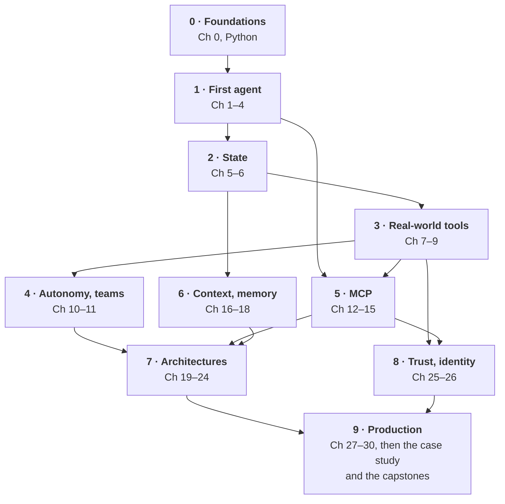

# Preface

In 2023, most people met large language models through a chat box: you typed, the model answered, and that was the end of it. In 2026, the interesting systems don't stop at answering. They look things up, run code, query databases, file tickets, fix failing tests and ask a person before doing anything risky. These systems are *agents*, and building them has become one of the most useful skills in software.

It is also one of the most confusing to learn. Tutorials tend to fall into two camps. Some show a framework that hides everything, so you can build a demo in ten minutes but can't explain why it failed in production. Others assume you already write Python fluently, understand web APIs and know what a JSON Schema is. Neither helps someone starting from nothing, and neither prepares you for the parts that matter once real users arrive: security, evaluation, cost and reliability.

I wrote this book to close that gap. It is meant to be an engineering book for building reliable AI agents, not only agent demos. Its promise fits in five words: **build, secure, evaluate, optimize, deploy**.

The subtitle is the route. Your **first agent** comes early: by Chapter 4 you've written the loop that every agent runs on, starting from no programming experience at all. **MCP**, the Model Context Protocol, is the open standard that connects agents to tools, data and each other, and you'll build servers, a client and agents published as servers. **Multi-agent orchestration** means teams of agents that route, delegate, review and vote under code's control, and you'll learn when a team beats a single agent and when it only costs more. **Production** means agents that are tested, measured, guarded and deployed, not demos that fall over the first time a real user touches them.

## What makes this book different

**You build everything by hand first.** Before you use a framework, you write the agent loop yourself: call the model, run the tools it asks for, send back the results, repeat. Once you've written it, every framework becomes readable, and you can debug the ones you choose to use.

**Every chapter ends in working code.** You build more than 20 agents and tools along the way, from a safe calculator to a code-fixing agent that runs tests, a SQL analyst that corrects its own queries, a multi-agent research team, a router, a writer-and-critic pair, an agent published as an MCP server and a deployed agent API. Six capstone projects then ask you to design a complete system of your own.

**Safety and measurement are part of the craft, not an afterthought.** Agents act on the world, so the book treats risk the way production teams do: approval gates in code, sandboxes, allow-lists, defenses against prompt injection and data exfiltration, and the "lethal trifecta" of private data, untrusted content and a way out. You also learn to measure. A change isn't an improvement until an evaluation suite says so, with enough trials to tell a real gain from luck.

**It follows open standards.** Part 5 is built around the Model Context Protocol (MCP), the open standard for connecting agents to tools and data, and the book keeps to it through the production chapters. You write MCP servers and a client of your own, publish an agent as a server, then use servers you didn't write, safely. You also meet Agent Skills and the A2A protocol for agents that talk to other agents.

**It gives you frameworks, not only code.** Chapter 1 introduces three that run through the whole book: the *dimensions of agency* (autonomy, state, planning, tool use, environment, persistence, feedback, delegation, adaptation), the *agent architecture reference model*, the layers every agent system has, and the *agent engineering lifecycle*: design, build, secure, evaluate, optimize, deploy, operate, improve. Each chapter says which layer it builds, and each part which stages. Later chapters add the principle under all of them, a *deterministic control plane* in which the model proposes and code enforces, plus an agent risk model, a quality scorecard, agent SLOs, a performance model and the economics of an agent, all collected as reference cards in Appendix I. Appendix K records the seven architecture decisions almost every project faces. And one system, an enterprise support agent, grows chapter by chapter from a single model call into a production service.

**It keeps concepts apart from products.** The code uses the Claude API and a free local model, but every idea is taught as a concept first. Appendix J maps each one to other providers and open-source stacks, and sections whose details change quickly are marked **API-dependent**, so you know which parts of the book will age and which won't.

**Everything runs the same way on every computer.** A Docker-based course kit gives you the same Python, libraries, sample data and MCP servers on Windows, macOS and Linux. There is nothing to install beyond Docker itself.

## Who this book is for

This book is for anyone who wants to build AI agents, including people who have never programmed. Chapter 0 and the Python interlude teach the programming you need; if you already write Python, you can move quickly through them. Developers who have built a simple chatbot will find the later parts (evaluation, security, context engineering, retrieval and deployment) useful on their own. Staff engineers, architects, performance engineers and engineering leaders should start with the reference model, the evaluation, SLO and performance chapters and the enterprise agent platform in Chapter 30; the "Real-world connection" sections and the capstones show what production agent systems require.

You don't need a background in machine learning. You won't train a model in this book; you'll learn to build reliable software around one.

## How the book is organized

The book has ten parts. Part 0 lays the foundations. Part 1 builds your first agent: tool calling and the agent loop. Part 2 gives agents state and lets them explore their environment. Part 3 connects them to real APIs and databases and keeps a human in the loop. Part 4 adds feedback loops and your first teams of agents. Part 5 covers MCP, from your first server to the 2026 protocol. Part 6 engineers what an agent knows: its context, its memory and its knowledge. Part 7 scales autonomy: long-running agents, planning and model routing, multi-agent orchestration, deterministic controls around probabilistic models, computer use and frameworks. Part 8 is about trust, security and identity. Part 9 takes agents to production: evaluation, observability, performance and cost, deployment, and MCP at company scale. Short interludes on Python, testing, regular expressions, SQL, measuring an agent and asynchronous code appear right before the chapters that need them. After Part 9, a case study follows one agent through a release, from requirements and threat model to an incident and its rollback, before the six capstones. "How to Use This Book," which follows, has a table of the parts and advice on where to start.

The diagram below shows how the parts build on each other. An arrow means the later part uses what the earlier one builds, so you can see what to read first if you want to jump ahead. Each chapter's Prerequisites line gives the detail.

Figure: The book at a glance: how the parts build on each other
Alt: Part 0, Foundations, leads to Part 1, First agent. Part 1 leads to Part 2, State, and to Part 5, MCP. Part 2 leads to Part 3, Real-world tools, and to Part 6, Context and memory. Part 3 leads to Part 4, Autonomy and teams, to Part 5 and to Part 8, Trust and identity. Parts 4, 5 and 6 lead to Part 7, Architectures. Part 5 also leads to Part 8. Parts 7 and 8 lead to Part 9, Production, which is followed by the case study and the capstones.

Every chapter follows the same pattern: learning objectives, a real-world connection, numbered lessons with runnable code, common mistakes, a summary, a list of resources for further reading and exercises at four levels. Every exercise has a reference solution in the course kit.

## Conventions used in this book

- `Code font` marks code, file names, commands, functions and values you type.
- A heading labeled **Listing** introduces a file, or an excerpt of one, from the course kit. You don't need to type it; it's already in your workspace. After the file name, each listing says what kind of code it is, so you never mistake teaching code for production code:
    - *Learning demo*: one idea, shown as plainly as possible. Run it and change it; don't build on it.
    - *Prototype*: a working agent or tool you can extend. Single user, simple storage, no authentication.
    - *Production pattern*: the controls, checks and records a production system uses, in a simplified implementation (file or in-memory storage, demo keys, one process). The chapter says what a production version adds.
    - Nothing in the kit is *production-hardened*. That takes real key management, durable storage, load and failure testing, monitoring and a security review; Chapter 30's launch checklist and the risk tiers of section 25.11 say what's needed.
- Commands start with `./course.sh`. On Windows, use `.\course.cmd` instead.
- Boxes labeled **Tip** give shortcuts and good practice. Boxes labeled **Caution** point out mistakes that cost money, lose data or open a security hole. Boxes titled **The support agent so far** follow the book's running example.
- **You are here** under a chapter's opening names the layers of the reference model (section 1.7) that the chapter builds.
- **API-dependent** under a section heading means its concept is durable but its names, parameters or prices change often.
- Exercises are labeled **Concept** (no code), **Simple**, **Medium** or **Complex**, and each has a **Done when** line so you know when you've finished.

## Using the code

All code, sample data, starter files, checkers and solutions are in the course kit, the book's companion repository at **github.com/sbittla/building-agentic-ai**. Clone it with Git or download it as a ZIP. Setup takes about 15 minutes and is described in "How to Use This Book." The examples use Anthropic's Claude models through the Claude API, which needs an API key and a small amount of credit. If you'd rather not pay, the kit can run a free open-source model, `qwen3.5:9b`, in Docker on your own computer instead; Appendix H shows how, and every exercise is labeled with the model it needs. Almost everything carries over to other model providers; section 24.6 shows what changes and how to switch. Appendix E estimates the cost: about {{cost:learner}} in API usage for all the chapters on Claude Sonnet 5, about half on Claude Haiku 4.5, and nothing on the local model.

Models, prices and libraries change quickly. The course kit pins every library version so the examples keep working, and Appendix G lists where to look when something has moved.

Each printing of this book is matched by a tag in the repository. This printing's is `edition-1.1`: `git checkout edition-1.1` gives you exactly the code, data and solutions the book was tested against. The tag never moves. `VERSION_MATRIX.md` lists the version of every library, model and protocol it was tested with, `CHANGELOG.md` and `MIGRATION.md` what has changed on `main` since, and `ERRATA.md` any mistakes found in this printing.

## A note on currency

This book was written and tested in September 2026. The ideas in it (the agent loop, tool design, approval gates, evaluation, context management and the lethal trifecta) have held steady as models have improved, and I expect them to keep holding. Model names and API details will change. When they do, the course kit's `VERSION_MATRIX.md` and the resources in Appendix G are the places to check first.

I hope you enjoy building these agents as much as I enjoyed writing about them.

*Srinivasa Rao Bittla* *September 2026*
